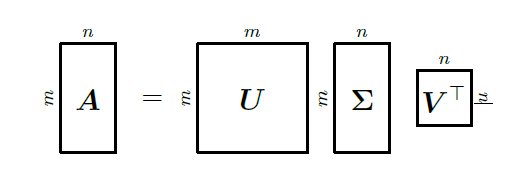
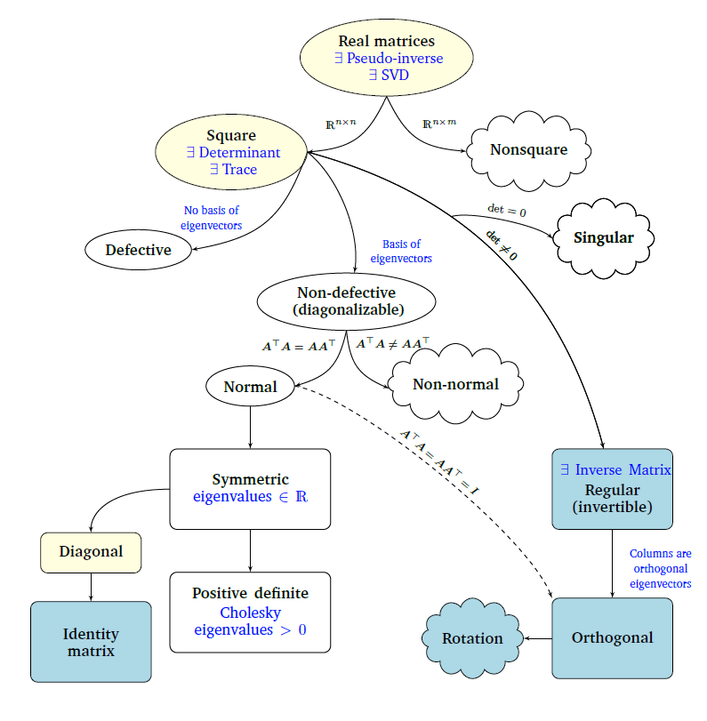

# Linear Algebra

## Table of Contents

- [Linear Algebra](#linear-algebra)
  - [Table of Contents](#table-of-contents)
  - [Pre-Requisites](#pre-requisites)
  - [What is Linear Algebra?](#what-is-linear-algebra)
  - [Scalar](#scalar)
  - [Systems of Linear Equations](#systems-of-linear-equations)
    - [Matrix Form](#matrix-form)
  - [Matrices](#matrices)
  - [Singular Matrix](#singular-matrix)
  - [Shape](#shape)
  - [Square Matrix](#square-matrix)
  - [Matrix Operations](#matrix-operations)
    - [Matrix Addition](#matrix-addition)
    - [Matrix Multiplication](#matrix-multiplication)
  - [NumPy](#numpy)
  - [Matrix Properties](#matrix-properties)
    - [Associativity](#associativity)
    - [Distributivity](#distributivity)
    - [Multiplication with Identity](#multiplication-with-identity)
  - [Inverse Matrix](#inverse-matrix)
  - [Transpose](#transpose)
  - [Row-Echelon Form](#row-echelon-form)
  - [Gaussian Elimination](#gaussian-elimination)
  - [Augmented Matrix](#augmented-matrix)
  - [Pivot](#pivot)
  - [Vector Space](#vector-space)
  - [Linear Combination](#linear-combination)
  - [Span](#span)
  - [Linear (In)dependence](#linear-independence)
  - [Generating Set (aka 'Spanning Set')](#generating-set-aka-spanning-set)
  - [Basis](#basis)
  - [Dimension Of Vector Space](#dimension-of-vector-space)
  - [Determinant](#determinant)
  - [Rank](#rank)
  - [Linear Mapping](#linear-mapping)
  - [Kernel (aka NullSpace)](#kernel-aka-nullspace)
  - [Image](#image)
  - [Domain](#domain)
  - [Co-Domain](#co-domain)
  - [Neutral Element](#neutral-element)
  - [Rank-Nullity Theorem](#rank-nullity-theorem)
  - [Ball of a norm](#ball-of-a-norm)
  - [Norms](#norms)
  - [Inner , Outer \& Dot Product](#inner--outer--dot-product)
  - [Projection Matrix](#projection-matrix)
  - [Symmetric, Positive Definite Matrices](#symmetric-positive-definite-matrices)
  - [Codirected \& Collinear](#codirected--collinear)
  - [Eigenvectors \& Eigenvector](#eigenvectors--eigenvector)
    - [Eigenvalue Intuition](#eigenvalue-intuition)
  - [Cauchy-Schwarz Inequality](#cauchy-schwarz-inequality)
  - [Orthogonality](#orthogonality)
  - [Orthogonal Matrix](#orthogonal-matrix)
  - [Orthonormal Basis(ONB)](#orthonormal-basisonb)
  - [Orthogonal Compliment](#orthogonal-compliment)
  - [Inner Product of Functions](#inner-product-of-functions)
  - [Definition](#definition)
  - [Properties](#properties)
  - [Orthogonality of Functions](#orthogonality-of-functions)
  - [Norm of a Function](#norm-of-a-function)
  - [Applications in AI/ML](#applications-in-aiml)
  - [Orthogonal Projection](#orthogonal-projection)
  - [Projection](#projection)
  - [Rotations](#rotations)
  - [Trace of a Matrix](#trace-of-a-matrix)
  - [Covariance Matrix](#covariance-matrix)
  - [Characteristic Polynomials](#characteristic-polynomials)
  - [Cholesky Decomposition](#cholesky-decomposition)
  - [Diagonal matrix](#diagonal-matrix)
  - [Eigendecomposition](#eigendecomposition)
  - [Jordan Matrix](#jordan-matrix)
  - [Singular Value Decomposition(SVD)](#singular-value-decompositionsvd)
  - [Matrix Approximation](#matrix-approximation)
  - [Matrix Phylogeny](#matrix-phylogeny)

---

## Pre-Requisites

- Python installed  
- NumPy (v2.2.6 used in examples)

> **Note:** Examples can be found in the `sub-folder`.

---

## What is Linear Algebra?

**Linear Algebra** is the study of vectors and the rules to manipulate them.  
Vectors are denoted as *→v* or *v*. Numerical data is represented as **vectors**, and a table of such data is represented as a **matrix**.  

*Why it matters:* Machine Learning data is often stored as vectors or matrices. Operations like dot products, matrix multiplication, eigenvalues, and transformations are used everywhere (e.g., linear regression, PCA, neural networks).

---

## Scalar

A scalar is either a *real number or a complex number*.

---

Matrices consisting of a *single row or a single column* are called *row vectors or column vectors*, respectively
The symbol *Ai∗* is used to denote the *ith row*, while *A∗j* denotes the *jth column of matrix A*

---

## Systems of Linear Equations

A **system of linear equations** is a collection of two or more linear equations involving the same unknown variables, considered simultaneously. Each equation represents a linear relationship, and the goal is to find values of the variables that satisfy all equations at once.

Mathematically:

\[
\begin{aligned}
a_{11}x_1 + a_{12}x_2 + \cdots + a_{1n}x_n &= b_1 \\
a_{21}x_1 + a_{22}x_2 + \cdots + a_{2n}x_n &= b_2 \\
\vdots \\
a_{m1}x_1 + a_{m2}x_2 + \cdots + a_{mn}x_n &= b_m
\end{aligned}
\]

- \(x_1, \dots, x_n\) — unknown variables  
- \(a_{ij}\) — coefficients  
- \(b_i\) — constants  

### Matrix Form

\[
\mathbf{A}\mathbf{x} = \mathbf{b}
\]

- **A**: coefficient matrix  
- **x**: vector of unknowns  
- **b**: outcome or constraint vector  

*Geometric Interpretation:* Each linear equation defines a line or plane. The solution set is the intersection of these lines/planes (a point, line, or empty set).

---

## Matrices

A **matrix** is a rectangular arrangement of numbers, symbols, or expressions organized into rows and columns.

\[
\mathbf{A} =
\begin{bmatrix}
a_{11} & a_{12} & \cdots & a_{1n} \\
a_{21} & a_{22} & \cdots & a_{2n} \\
\vdots & \vdots & \ddots & \vdots \\
a_{m1} & a_{m2} & \cdots & a_{mn}
\end{bmatrix}
\]

- \(a_{ij}\): element in the \(i\)-th row and \(j\)-th column  
- \(m\): number of rows  
- \(n\): number of columns  

**Interpretation:**  

- Collection of vectors (rows or columns)  
- Linear transformation mapping input vectors to output vectors  
- Compact representation of a system of linear equations  

---

## Singular Matrix

It is a matrix that does not have an inverse.

A matrix is *singular* if:

- det(A) = 0

if the matrix is singular, then the linear system may have no solution or infinitely many solutions but cannot have a unique solution .

---

## Shape

Matrix *A* is said to have shape or size *m x n*(pronounced as m by n) whenever *A* has exactly *m* rows and *n* columns.

---

## Square Matrix

Whenever *m = n*,*A* is called a *square matrix* otherwise *rectangular*.

---

## Matrix Operations

### Matrix Addition

For matrices of the same shape:

\[
A + B =
\begin{bmatrix}
a_{11}+b_{11} & \cdots & a_{1n}+b_{1n} \\
\vdots & \ddots & \vdots \\
a_{m1}+b_{m1} & \cdots & a_{mn}+b_{mn}
\end{bmatrix}
\]

### Matrix Multiplication

For \(A_{m \times n}\) and \(B_{n \times p}\):

\[
C = AB
\]

> Note: Matrix multiplication is **not element-wise**. Element-wise multiplication is the **Hadamard product**.

**Example:**
\[
A = \begin{bmatrix} 1 & 2 \\ 3 & 4 \end{bmatrix}, \quad B = \begin{bmatrix} 5 & 6 \\ 7 & 8 \end{bmatrix}
\]
\[
AB = \begin{bmatrix} (1*5 + 2*7) & (1*6 + 2*8) \\ (3*5 + 4*7) & (3*6 + 4*8) \end{bmatrix} = \begin{bmatrix} 19 & 22 \\ 43 & 50 \end{bmatrix}
\]

---

## NumPy

**NumPy** provides multi-dimensional arrays and operations for numerical computing:

- Vectors, matrices, tensors in any dimension
- Element-wise operations: +, -, *, /  
- Linear algebra utilities (`np.linalg`) — inverse, determinant, eigenvalues, solving systems  
- Efficient handling of large datasets  
- Foundation for ML libraries (TensorFlow, PyTorch, pandas)

**Example Code:**
```python
import numpy as np

# Create matrices
A = np.array([[1, 2], [3, 4]])
B = np.array([[5, 6], [7, 8]])

# Matrix multiplication
C = A @ B  # or np.dot(A, B)
print(C)  # Output: [[19 22] [43 50]]

# Determinant
det_A = np.linalg.det(A)
print(det_A)  # Output: -2.0
```

## Matrix Properties

### Associativity

\[
\forall A \in \mathbb{R}^{m \times n}, B \in \mathbb{R}^{n \times p}, C \in \mathbb{R}^{p \times q} : (AB)C = A(BC)
\]

### Distributivity

\[
(A + B)C = AC + BC
\]

\[
A(C + D) = AC + AD
\]

### Multiplication with Identity

\[
I_m A = A I_n = A \quad (I_m \neq I_n \text{ if } m \neq n)
\]

A clean ML data pipeline can be described as:

- Each step builds on the previous → data flows cleanly
- Ensures no redundant information, scaled features, and optionally simplified space
- You can add more steps later (feature engineering, outlier removal, splitting train/test)

**In ML Terms**:

1. Rank check → ensures full expressive capacity
2. Basis vectors → tells you directions of variation
3. SVD/PCA → optionally reduce to most informative directions
4. Scaling → ensures numerical stability for models

---

## Inverse Matrix

- Only square matrices can have an inverse  
- Exists if determinant ≠ 0 (matrix is **invertible**)  
- Denoted \(A^{-1}\), used in linear regression  

\[
AA^{-1} = I = A^{-1}A
\]

\[
(AB)^{-1} = B^{-1}A^{-1}, \quad (\text{not } A^{-1}+B^{-1})
\]

---

## Transpose

\(\mathbf{A}^T\) — obtained by swapping rows and columns  

Properties:

\[
(\mathbf{A}^T)^T = \mathbf{A}, \quad (\mathbf{A}\mathbf{B})^T = \mathbf{B}^T\mathbf{A}^T, \quad (\mathbf{A}+\mathbf{B})^T = \mathbf{A}^T + \mathbf{B}^T
\]

**Symmetric Matrix:** Square matrix equal to its transpose  

- Covariance and Hessian matrices are symmetric  
- Real eigenvalues and orthogonal eigenvectors
- A symmetric matrix S ∈ Rn×n can always be diagonalized.

---

## Row-Echelon Form

- Non-zero rows above zero rows  
- Leading entry (pivot) of each row to the right of the one above  
- Entries below pivots = 0  

**Reduced Row-Echelon Form:**  

- Each pivot = 1  
- Pivot is the only non-zero in its column  

---

## Gaussian Elimination

Method to solve linear systems by transforming a matrix to row-echelon form.

**Steps to execute Gaussian elimination**:
At each step, the strategy is to focus on one position called the *pivotal position*,and to eliminate all terms below this position using the three elementary operations. The co-efficient in the pivot position is called *pivot/pivotal element*. ***(Only Non-Zero elements can be a pivot)***

1. Step 1 : Eliminate all the terms below the first pivot.
2. Select a new pivot.
3. Eliminate all terms below the second pivot.

At the end, we say that the system has been *triangularized*. A triangular system is easily solved by a simple method known as *back-substitution*.

Gaussian elimination = detects exact linear dependence

---

## Augmented Matrix

Combines coefficients and constants into one matrix for row operations.It is separated by a vertical line *|* and on the LHS it contains co-efficient and on the RHS it contains the numbers which are solutions to the system. Such a matrix is called *Augmented Matrix*.

It is denoted by [A|b].

---

## Pivot

Leading coefficient of a row (first non-zero number from left), forming a **staircase structure** in row-echelon form.Only nonzero numbers are allowed to be pivot

---

## Vector Space

A set \(V\) with operations **vector addition** and **scalar multiplication** is a vector space over field \(F\) if it satisfies:

1. Closure under addition  
2. Closure under scalar multiplication  
3. Addition rules: associativity, commutativity, zero vector, additive inverses  
4. Scalar rules: distributivity and compatibility with field multiplication  

---

## Linear Combination

A linear combination of vectors is formed by multiplying each vector by a scalar and adding the results:

\[
y = \lambda_1 v_1 + \lambda_2 v_2
\]

- \(v_1, v_2 \in V\)  
- \(\lambda_1, \lambda_2 \in \mathbb{R}\)

---

## Span

Span is the set of all vectors you can generate using linear combinations of given vectors — independence is optional

Mathematically, span can scale up to infinity.

**In ML**:

- Feature space
- PCA direction
- Column space of a data matrix
- Hypothesis spaces in linear models

---

## Linear (In)dependence

It describes whether vectors provide unique information or whether some vectors are redundant.

1. Linear Independence: A set of vectors is *linearly independent* if *no vector can be written as a linear combination of the others*.

*Note* : Vectors point to genuinely different direction and each vectors provides new information.

1. Linear Dependence: A set of vectors is *linearly dependent* if at least one vector can be expressed as a linear combination of the others.

*Note* : Some vectors are redundant and lies in the span of the others.

*Quick Checks*:

1. If a set contains the zero vectors -> **Dependent**
2. More vectors than the dimension of the space -> **Dependent**
3. Non-Zero determinant (square matrix)-> **Independent**

*Practical application rule in ML*:

For linear or regression-based ML, always check for rank/linear dependence.

For other models, it’s optional but still good practice for optimization and clarity.

*Formula*:

\[
\lambda_1 \mathbf{v}_1 + \lambda_2 \mathbf{v}_2 + \dots + \lambda_n \mathbf{v}_n = 0
\]

- If the only solution is \(\lambda_1 = \lambda_2 = \dots = \lambda_n = 0\), the vectors are **linearly independent**.  

---

## Generating Set (aka 'Spanning Set')

A *Generating Set* is set of vectors from which the entire vector space can be built using linear combination.

Let **(V,+,.)** be a vector space and S = {v1,v2,....,vn} ⊆ V

S is called a generating set for V if every vector in V can be written as a linear combination of vectors in S.

**Note**: The Span of S is the *set of all linear combinations* of vectors in S.

*Key Equivalence*: **span(S) = V**

---

## Basis

A basis is a set of vectors that builds the entire space and does so without redundancy.

*Mental model*:

Spanning → enough vectors

Independence → no extra vectors

*Enough + no waste = basis.*

Number of basis vectors = dimension of the space

**Basis shows two vectors are**;

- Independent = no redundancy
- spans the plane = full coverage
- Minimal = remove one, space collapses into a line

*Note*: Number of independent rows/columns = dimension of the row space / column space = rank of the matrix

---

## Dimension Of Vector Space

The dimension of vector space *V* is the *number of vectors in any basis of V*.

*The following steps are required to find the dimension of vector*:

1. Find a basis -> count vectors
2. From a spanning set-> remove the redundancy
3. From a linearly independent set -> extend if needed

*Note*: Number of Pivot = Dimension of the span

---

## Determinant

A determinant is a mathematical object in analysis and solution of systems of linear algebra equation.

Determinant are only defined for square matrices.

The *determinant* of a square matrix is a function that maps *A* onto a real number.

it is denoted as *det(A)* or *|A|*(the notation mustn't be confused with the absolute value)

Properties:

- \(\det(AB) = \det(A)\det(B)\)
- \(\det(A^{-1}) = 1/\det(A)\)
- \(\det(A^T) = \det(A)\)

**Geometric Meaning:** Scale factor of linear transformation
**ML Application:** Volume change in probability distributions

***Note***:

- for any square matrix A , it holds that A is invertible if and only if *det(A) ̸= 0*.
- *Sarrus’s rule*: It is a special method which can easily obtain the determinant of *3 x 3* matrix only.
                - **Step 1 of Sarrus’s rule**: Write the first two columns again to the right of the matrix.
                - **Step 2 of Sarrus’s rule**: Sum the product of the diagonals going down the right.
                - **Step 3 of Sarrus’s rule**: Sum the products of the diagonal going up right.
                - **Step 4 of Sarrus’s rule**: Determinant = (down the right sum) - (up right sum) [**det(A)=(aei+bfg+cdh)−(ceg+afh+bdi)**]
- for a triangular matrix, the determinant is the product of the diagonal elements.
- **Laplace Expansion**: for any *n x n* matrix, the determinant can be expressed along any row or column.
                - For each element in that row/column:
                - 1. Multiply the element by the determinant of the smaller matrix left after removing that element’s row and column (called the minor).
                - 2. Multiply by +1 or -1, depending on the position. The rule is: If the *sum of the row and column numbers is even → + , If odd → -*.
- Swapping rows/columns changes the sign of *det(A).*

---

## Rank

The number of linearly independent columns of a matrix **A ∈ Rmxn** equals the number of linearly independent rows and is called the rank of *A* and is denoted by *rk(A)*
*Note:* rk(A)=number of linearly independent rows=number of linearly independent columns

*Also equals:*

- number of pivots
- dimension of column space
- dimension of image

*Mental shortcut*:

- Zero row never counts
- Rank = number of pivots
- Row rank = column rank
  
---

## Linear Mapping

For vector spaces *V*,*W*, a mapping *Φ: V -> W* is called linear mapping (or a vector homomorphism/linear transformation) if it preserves vector addition and scalar multiplication.

*To prove a map is linear*:

- Take arbitrary 𝑢,𝑣 ∈ 𝑉

- Take arbitrary scalars α,β

- Verify the below equation -

1. **Preservation of scalar multiplication**
\[
\Phi(\alpha v) = \alpha\,\Phi(v)
\]

2. **Preservation of addition**
\[
\Phi(u + v) = \Phi(u) + \Phi(v)
\]

If both properties hold, then \(\Phi\) preserves the vector space structure and is called a **linear mapping**.

**Types of linear mapping**:

- *Injective Mapping (One To One)*: No two different inputs maps to the same output.
- *Surjective (Onto)*: Every element in the target space W is hit by **at least one input from** V.
- *Bijective (combination of both = Surjective + Injective)*: Each input maps to a unique output and every output is used.
  
1. *Endomorphism* = Linear map from a vector space to itself *Φ:V→V*
2. *Automorphism* = Linear map from a vector space to itself that is bi-jective. *Φ:V→V*
3. *Isomorphism* = Linear map between two different vector spaces that is bi-jective. *Φ:V→W*
4. *Identity Map* = Maps every vector to itself.

---

## Kernel (aka NullSpace)

The *kernel* of Φ is the set of all vectors in the domain that are mapped to the *zero(neutral) vector* of the co-domain.

*Plain Meaning*: All input vectors that the linear map destroys/ is lost.

These vectors carry *no output information*.The entire direction disappears.

Null space = set of all vectors that map to zero.
Its dimension = nullity. Shape depends on rank

*ML Intuition*: Information that is lost.Features that do not affect the output

---

## Image

The *image* of Φ is the set of all vectors in the co-domain that can be obtained as outputs of Φ.

*Plain Meaning*: All output that the map can possibly produce.

*ML Intuition*: Information that is retained.

---

## Domain

The *domain* of Φ is the vector space *V* from which inputs are taken.

---

## Co-Domain

The *Co-Domain* of Φ is the vector space *W* in which outputs lie.

---

## Neutral Element

The *neutral element* is the zero vector of the co-domain *W*, satisfying,

*w + 0W = w | ∀w∈W*;

In any vector space there is a special vector called the *zero-vector*.

- it is written as 0
- adding it to any vector changes nothing.

---

## Rank-Nullity Theorem

For *A ∈ Rmxn*,

**rank(A) + nullity(A) = n**;

where;

- nullity = dimension of null space
- n = number of columns (input dimension)

---

## Ball of a norm

Given a norm |.|, the *unit ball* is:

        B={x:∥x∥≤1}

It simply means, *All points whose distance from origin is 1 or less*.

Different norms give different shapes of this ball.

---

## Norms

A *norm* is just a function that *measures the size, length, or magnitude of a vector* or in simple terms : It is the distance of the line segment starting from the origin till the end of the line segment.
It is denoted by *||x||* and a function ||x|| is a norm if it satisfies:

1. *Positivity*: ||x|| > 0 and only ||x|| = 0 when x =0
2. *Scaling*: ||αx|| = ||α|| * ||x||
3. *Triangular Inequality*: ||x + y|| ≤ ||x||  + ||y||

**Important Norms**:

**L2 Norm (Euclidean Norm)**:
        It is the most common norm

            ∥x∥2​= sqrt(x1**2​+x2**2​+⋯+xn**2​​)

        This is the ordinary distance from the origin.

      **Intuition**: Length of the vector in regular geometry.

      **Used in ML for**:

            - Loss Function(MSE)
            - Weight decay (L2 Regularization)
            - Gradient Descent
            - Distance between embeddings.

    1. **L1 Norm (Manhattan Norm)**:
               ||x||1 = |x1| + |x2| + ... + |xn|

        *Intuition* : Distance in a grid like city (Manhattan Blocks)

        *ML Uses*:

           - Lasso regularization
           - Sparsity enforcement
           - Robust Models(less sensitive to outliers)

    2.  **L∞ Norm (Max Norm)**:
                ∥x∥∞​=imax​∣xi​∣

        *Intuition* : Maximum movement in any coordinate.

    *ML uses*:

        - Adversarial examples
        - Robust optimization
        - Infinity-ball constraints
        - Fast gradient sign methods (FGSM)
  
    3. *Lp Norm (General Form)*:

            ∥x∥p​=(∣x1​∣p+⋯+∣xn​∣p)1/p

    *Special cases*:

        - p = 1 → L1
        - p = 2 → L2
        - p → ∞ → max norm

**MATRIX NORMS (Advanced but Important)**:

    For matrices we have:

    1. *Frobenius Norm*

        ∥A∥F​=i,j∑​aij2​​

        Used heavily in:

                - PCA
                - SVD
                - Matrix decomposition
                - Regularization

    2. *Spectral Norm*  

    Largest singular value.

    Used in:

        - Stability analysis
        - Lipschitz constraints
        - Adversarial robustness
        - Image Compression

---

## Inner , Outer & Dot Product

lets say we have have vectors ; u = (u1,u2,u3) & v = (v1,v2,v3)

1. **Inner Product**:

- Standard inner product in *R3* = dot product
- Weighted inner product.
      - ***Inner Product => ⟨u,v⟩M​=uTMv***

where *M* is a positive definite 3 x 3 matrix.

- Output is a scalar but now its "weighted" according to *M*.
- Dot Product = special case where *M = I*

1. **Dot Product**:

The *Dot Product* of u and v is;

      - u . v = u1v1 + u2v2 + u3v3
    - The output is a scalar
    - It measures how much two vectors point in the same direction

**Example:** For u = [1, 2, 3] and v = [4, 5, 6], dot product = 1*4 + 2*5 + 3*6 = 32.

3. **Outer Product**:

The outer product of u & v produces;

      - u ⊗ v = [u1v1 , u1v2 , u1v3]
                 [u2v1 , u2v2 , u2v3]
                 [u3v1 , u3v2 , u3v3]
      - Output matrix = shape = len(u) x len(v)
      - Each element (i,j) = ui . vj
      - Useful in ML for constructing co-variance matrices ,  projection or rank-1 updates.           

---

## Projection Matrix

A *Projection Matrix* is matrix that takes any vector and drops it onto subspace - keeping the part that belongs to that subspace and discarding the rest.

A matrix *P* is a projection matrix uf ut satisfies:

1. *Idempotent*:  P^2^ = P
2. *Symmetric*: P^T^ = P

Let *A* be a matrix whose columns span the subspace;

**Projection Matrix** :  P = **A(A^T^A)^-1^A^T^**

This projects any vector onto the column space of A.

**Importance in ML**:

1. Linear Regression(core): y^​=Py
                - You are projecting the target onto the space spanned by the features.
                - Regression  = best projection in least-square sense.

2. Dimensionality Reduction: PCA = projection onto top eigenvector subspace.
3. Denoising: Noise lives outside the subspace - projection removes it.
4. Feature selection intuition:
      - Keeps direction that matters
      - discards the orthogonal junk.

**Note**:

1. Rank of P = dimension of the subspace
2. Eigenvalues of P = only 0 or 1

---

## Symmetric, Positive Definite Matrices

A **symmetric matrix** is a square matrix that equals its transpose: \(A = A^T\).

A matrix is **positive definite** if all its eigenvalues are positive, or equivalently, for any non-zero vector \(x\), \(x^T A x > 0\).

**Properties:**

- Symmetric and positive definite matrices are invertible.
- Used in optimization (e.g., quadratic forms in loss functions).
- Eigenvalues are real and positive.

**Example:**
\[
A = \begin{bmatrix} 2 & 1 \\ 1 & 2 \end{bmatrix}
\]

- Symmetric: Yes.
- Positive definite: Yes (eigenvalues ≈ 3 and 1).

**ML Uses:**

- Covariance matrices in statistics.
- Hessian matrices in convex optimization.

---

## Codirected & Collinear

Two vectors that point in the same direction are called *codirected*.
Two vectors are *collinear* if they point in the same or the opposite direction.

---

## Eigenvectors & Eigenvector

For a square matrix A, a non-zero v is an eigenvector if: **Av=λv**

- v = eigenvector (direction that  doesn't change under the transformation)
- λ = eigenvalue (how much the vector is stretched or compressed)

*Intuition*: Eigenvalue = “how much the matrix stretches the space along a specific direction”

**Why eigenvalues matter**:

- Variance along principal directions (PCA)
- Covariance matrix → eigenvectors = principal directions of data
- Eigenvalues = variance along each direction
- Larger eigenvalue → that direction explains more variability in the data
- In PCA, we pick top eigenvectors corresponding to largest eigenvalues
- Dimensionality reduction
- Helps compress data without losing much information
- Directions with tiny eigenvalues → less important → can be dropped
- Stability / dynamics in ML models
- In RNNs, dynamical systems → eigenvalues of weight matrices determine stability
- Neural networks → sometimes used in regularization or understanding feature transformations
- Trace and determinant connection
- Trace = sum of eigenvalues → total variance
- Determinant = product of eigenvalues → volume scaling factor

**Summary for AI/ML**:

- Helps identify principal directions (PCA)
- Guides dimensionality reduction
- Measures stability or influence of transformations in models
- Trace = total variance, eigenvalues = distribution of variance across features

*Remark*: in linear algebra and software, it is often convention that eigenvalues are sorted in descending order so that the largest eigenvalues are associated eigenvector are called the second eigenvalue and its associated eigenvector and so on.

***Eigenvector = direction of variance in feature space ; Eigenvalue = magnitude of variance along that direction***

### Eigenvalue Intuition

For a matrix \(A\) and its eigenvector \(v\):

\[
A v = \lambda v
\]

- \(\lambda\) = scalar that **scales the vector** \(v\)  
  - \(|\lambda| > 1\) → vector gets **stretched**  
  - \(|\lambda| < 1\) → vector gets **compressed**  
  - \(\lambda < 0\) → vector **flips direction**  

- The **vector does not rotate**, only gets scaled along the same line.
- A matrix and its transpose have the same eigenvalues (including multiplicities). However, their eigenvectors are generally different unless the matrix is symmetric
- Symmetric, positive definite matrices always have positive, real eigenvalues.
- Distinct eigenvalues → eigenvectors form a full set of independent directions → you can transform, diagonalize, or project in ML without losing information.
- A square matrix A ∈ Rn×n is defective if it possesses defective fewer than n linearly independent eigenvectors.

**Relationship between eigenvalues and stability in ML models**:

1. Eigenvalues > 1 → Exploding gradients
2. Eigenvalues < 1 → Vanishing gradients
3. Eigenvalues = 1 → Stable propagation

---

## Cauchy-Schwarz Inequality

For any two vectors v and u;
        - |dot(u,v)| ≤ ||u|| . ||v||

Equality holds only when vectors are collinear.

Cauchy-Schwarz is the theorem that prevents inner products from lying, norms from breaking, and geometry from collapsing.

**What it means**:

- LHS : How much two vectors align (dot product)
- RHS : Maximum possible alignment (lengths multiplied)

**Mental model:**
You can't get more synergy than the raw materials allow.

**ML or real world application**:

1. Co-relation bounds
2. Cosine similarity :  used in embeddings,NLP,recommendation systems
3. Regularization
4. Ensuring distance/norms behave correctly.

---

## Orthogonality

Two vectors *x & y* are orthogonal if and only if *(x,y) = 0*.

- It is denoted as *x ⊥ y*
- additionally if ||x|| = ||y|| = 1 then the unit vectors are *orthonormal*.

An implication of this definition is that the 0-vector is orthogonal to very vector in the vector space.
Geometrically, orthogonal vectors have right angle with respect to a specific inner product.

---

## Orthogonal Matrix

A *square matrix A ∈ Rn×n* is an orthogonal matrix if and only if its column are orthonormal so that;
                        AA^T^ = I = A^T^A

which implies that : A^-1^ = A^T^

The inverse is obtained by simply transposing the matrix.

Orthogonal = rotate (or reflect)

---

## Orthonormal Basis(ONB)

A set of vectors in *n*-dimension vector space *V* is an orthonormal basis if it satisfies;

1. *Orthogonality*: Every pair of vectors is perpendicular => (bi,bj) = 0 for all i not equal to j
                - this means that vectors point in *independent directions.*

2. Unit Length : Every vector has length 1 => (bi,bj) = 1 for all i

You can turn an orthogonal basis into an ONB by normalizing each vector:
                     - bi^ONB^​= bi/∥bi​∥​

---

## Orthogonal Compliment

If a subspace *W* of a vector space *V*, then the orthogonal compliment is *the set of vector in V that are orthogonal to every vector W*.
It is denoted as *W⊥ (read as 'W perp')*.

*Key Properties*:

1.Perpendicular to everything in W.
2. It's a subspace too: W⊥ is always a subspace V
3. Complimentary dimensions: dim(W) + dim(W⊥) = dim(V)
4. Unique Decomposition: Every vector v ∈ V can be written uniquely as ; v = w + w⊥ where w ∈ W and w⊥ ∈ W⊥

---

## Inner Product of Functions

## Definition

For functions \(f(x)\) and \(g(x)\) defined on an interval \([a, b]\), the inner product is usually defined as:

\[
\langle f, g \rangle = \int_a^b f(x) \, g(x) \, w(x) \, dx
\]

Where \(w(x)\) is a weight function (often \(w(x) = 1\), but can vary depending on context, e.g., Legendre or Chebyshev polynomials).

The integral measures how much \(f\) and \(g\) “overlap” over the interval.

---

## Properties

The inner product satisfies:

- **Symmetry:** \(\langle f, g \rangle = \langle g, f \rangle\)  
- **Linearity:** \(\langle af + bg, h \rangle = a \langle f, h \rangle + b \langle g, h \rangle\)  
- **Positive-definite:** \(\langle f, f \rangle \ge 0\), and \(\langle f, f \rangle = 0 \iff f = 0\)

---

## Orthogonality of Functions

Two functions \(f\) and \(g\) are orthogonal if:

\[
\langle f, g \rangle = 0
\]

**Example:** On \([-π, π]\):

\[
\int_{-π}^{π} \sin(nx) \cos(mx) \, dx = 0
\]

Sine and cosine functions of different frequencies are orthogonal. This is the basis of Fourier series, where any periodic function is expressed as a sum of orthogonal sine and cosine functions.

---

## Norm of a Function

The inner product defines a norm:

\[
\|f\| = \sqrt{\langle f, f \rangle} = \sqrt{\int_a^b f(x)^2 \, dx}
\]

- Similar to the length of a vector.  
- Allows defining distance between functions:

\[
\text{distance}(f, g) = \|f - g\|
\]

---

## Applications in AI/ML

- **Kernel methods:** Inner product in function spaces is the foundation of kernels in SVMs.  
- **Fourier and wavelet analysis:** Feature extraction and signal processing.  
- **PCA in function space (Functional PCA):** Functions are treated like vectors; inner products define projections.  
- **Orthogonal expansions:** Approximating functions using basis functions (like polynomials or trig functions).

---

## Orthogonal Projection

Given;

- A vector v in a vector space V
- A subspace W ⊆ V

The orthogonal projection of v onto W , denoted *projW​(v)* is the vector in W that is the closest to v.

in other words; the difference between v and its projection is perpendicular to the subspace W: ***v−projW​(v)⊥W***

*Intuition/ML Use*:

- Projects higher dimension into lower dimensional subspace
- Minimizes squared error between original vector and its representation subspace.
- Used in linear regression, PCA , dimensionality reduction etc.

---

## Projection

A projection is the closest approximation of a vector within a subspace, obtained by removing the component perpendicular to that subspace.

*Intuitively*:

A shadow cast by a vector onto a subspace (line, plane, etc.) along a perpendicular direction.The shadow is the projection.The leftover vector (from the tip of the shadow to the original vector) is perpendicular to the subspace.

---

## Rotations

A rotation is a linear mapping that rotates a plane by an angle θ about the origin without changing its length.

*Properties*:

- it preserves length(norms)
- it preserves angles between the vectors
- it does not reflect (determinant = 1 for the rotation matrix)
- the vector keeps its magnitude but points in a new direction

*Rotations in R^2^*:

1. Rotated vectors are linearly independent and are basis of the R^2^.
2. The rotations performs a basis of change.
3. rotations are linear mappings so that we can express them by a *rotation matrix*.

---

## Trace of a Matrix

The *trace* of a square matrix *A ∈ R^n×n^* is defined as the sum of the diagonal elements of A.

Please note that is is only meaningful in regards of AI/ML when applied to *co-variance matrix,Gram matrices, or weight matrices, not raw data tables.*

**Significance of trace in AI/ML**:

1. *Total variance in data*: for a covariance matrix, the trace equals the sum of variance of all features
2. shows how much information or *spread* exists across your dataset.
3. *Eigenvalue Connection*: Trace = sum of eigenvalues. and it indicates total strength of principal directions used in PCA,dimensionality reduction and understanding feature importance.
4. *Regularization / loss function*: Trace can appear in optimization objectives as a computationally simple scalar summarizing matrix properties.

---

## Covariance Matrix

A Covariance matrix is a *square matrix* that summarizes how features in a dataset vary together.

**Properties**:

1. Each diagonal element = variance of that feature
2. Each off-diagonal element = covariance between two features
   1. Positive -> both features increase together
   2. Negative -> both features decrease together
   3. Zero -> features are independent

Formally, for a dataset *X* with *n* samples and *d* features:

-> Cov(X) = (1 / (n-1)) * (X_centered.T @ X_centered)

Where X_centered = data with mean of each feature subtracted.

- Shape = (d × d) → square
- Diagonal = variance of each feature
- Off-diagonal = feature correlations in magnitude

**Intuition**:

- Spread of each feature
- Diagonal shows how much a feature varies on its own.
- Off-diagonal shows how strongly features move together.
- Large positive → redundancy or strong positive correlation
- Large negative → inverse relationship
- Near-zero → features are independence
- *Trace connection*:Trace of covariance matrix = total variance across all features
- *Eigenvalue connection*: Eigenvectors = principal directions, Eigenvalues = variance along those directions.PCA uses this to reduce dimensions while keeping most variance

**Importance in AI/ML**:

- Dimensionality reduction (PCA): Covariance matrix identifies important directions (high variance)
- Trace = total variance available to capture
- Feature redundancy analysis : Large off-diagonal values → features may be redundant → can drop some
- Data scaling / preprocessing: Covariance magnitude depends on units → standardize features before ML
- Multivariate analysis: Gaussian models, Mahalanobis distance, portfolio variance → all rely on covariance matrices

---

## Characteristic Polynomials

For a square matrix *A* of size n x n:
          - Characteristics Polynomial = p(λ) = det(A - λI)

where; λ = scalar(eigenvalue candidate),I is identity matrix & det = determinant

Characteristic polynomial is the algebraic tool to find eigenvalues.

**Importance in AI/ML**:

- PCA(Principal Component Analysis)
- PCA = eigenvectors of covariance matrix
- eigenvalues = variance along principal directions
- In neural networks, dynamical systems,control theory -> eigenvalues determine stability
- *Matrix Diagnostic*: Trace = sum of eigenvalues ; Determinant = product of eigenvalues & Characteristic polynomial = full spectrum → complete picture of matrix behavior

---

## Cholesky Decomposition

It is a way to factor a symmetric, positive definite matrix A *into the product of a lower triangular matrix L and its transpose L^T^*.

Formula => A = LL^T^

where; L is lower triangular matrix and L^T^ is transpose of L

*Requirements*: It provides a square root equivalent operation on symmetric,positive matrices that is useful in practice.
*Note*: Covariance matrices in ML are always symmetric and positive-definite → Cholesky works perfectly for them.

**Why it matters in AI/ML:**

1. Solving linear systems efficiently
2. Sampling from multivariate normal
3. Numerical stability
4. Connection to PCA / covariance

- the determinant is simply the product of its diagonal entries.

---

## Diagonal matrix

A diagonal matrix is a matrix that has zero on all-diagonal elements.

They allow fast computation of determinants,powers and inverses.

The determinant is the product of its diagonal entries, a matrix power *D^k^* is given by each diagonal element raised to the power *k*.

The inverse *D^-1^* is the reciprocal of its diagonal elements if all of them are non-zero.

A diagonal matrix can:

- stretch
- shrink
- flip
- zero out

---

## Eigendecomposition

A Square matrix A ∈ R^nxn^ can be factored into **A = PDP^-1^** if and only if the eigenvectors of A form a basis of Rⁿ.

in simple words, the statement can be described as if a matrix has enough independent directions, the matrix can be rotate the space, stretch along the axes and then rotate back.

So,

- P⁻¹ → move into eigenvector space
- D → scale along axes
- P → return to original space

The only requirement is that To build P (n×n invertible), you need n independent columns.

No inverse = no eigendecomposition.

The eigenvalue decomposition requires square matrices

---

## Jordan Matrix

A Jordan matrix is an almost diagonal matrix where each eigenvalue may have 1’s above the diagonal to account for missing eigenvectors.

it has the properties such as:

- λ on the diagonal
- 1's on the super-diagonal(just above the diagonal)
- everything else is 0
- Every square matrix has a Jordan form.

when eigendecomposition fails jordan matrix is obtained

---

## Singular Value Decomposition(SVD)

*Theorem* : Let A ∈ R^m×n^ be a rectangular matrix of rank ∈ [0,min(m,n)].  The SVD of A is a decomposition of the form;



The diagonal entries σi, i = 1, . . . , r, of Σ are called the singular values
ui are called the left-singular vectors
vj are called the right-singular vectors.
By convention, the singular values are ordered, i.e., σ1 ⩾ σ2 ⩾ σr ⩾ 0.

Where;

- U = Output Directions (Orthogonal Matrix) -> (rotation) = left singular vectors
- Σ = Scaling Strength (Diagonal Matrix) -> (Stretching) = diagonal
- V^T^ = input directions (Orthogonal Matrix) -> (rotation) = right singular vectors

**What each piece really means**:

1. *V (right singular vectors)*: it answers which feature combination matters and which directions contain information.In ML terms, feature direction.
2. *Σ (singular values)*: it signals importance/strength. Big value -> important direction, smaller means noise and zero is for useless.. in ML terms it means signal strength
3. *U (left singular vectors)*: Output Directions. it shows how transformed data spreads. Usually less important.

**Critical properties**:

1. The SVD always exists for all or any kind of matrix.
2. Singular values ≥ 0. there is no negative scaling, therefore clean interpretation:strength only.
3. Rank = number of non-zero singular values.
4. Best low-rank approximation. this powers image compression,embeddings,recommenders and PCA.
5. PCA = SVD

In simple words, this means, *rotate-> scale-> rotate*.This is exactly like eigendecomposition but more general.

---

| Goal / Problem                                | Tool to Use                      | Notes                                          |
| --------------------------------------------- | -------------------------------- | ---------------------------------------------- |
| Reduce dimensionality / correlated features   | PCA / SVD                        | Covariance eigenvectors or SVD on data         |
| Solve linear system (Ax = b) (symmetric + PD) | Cholesky                         | Efficient, stable                              |
| Solve general linear system (Ax = b)          | LU decomposition                 | Works always, slightly slower                  |
| Generate correlated samples / whitening       | Cholesky                         | Factor covariance matrix                       |
| Compute pseudo-inverse / low-rank approx      | SVD                              | Works for non-square, ill-conditioned matrices |
| Explore feature variance / redundancy         | Covariance / Trace / Eigenvalues | Pre-training insight                           |

---

## Matrix Approximation

A matrix A can be thought of as being built from r simple layers, each layer being a rank-1 matrix.

Each layer is made from left vector ui,a right vector vi and a weight 𝜎i.

- uivi^T^ -> a rank-1 matrix (the simplest kind of matrix like a single direction or pattern)
- 𝜎i -> tells you how important this layer is.

**Key Note**:

- You can approximate A by just keeping the top k most important layers:
- This is rank-k approximation, which is exactly what you did with the image using top-k singular values.

To measure the error/difference between A and its rank-k approximation A(k), we need the notion of a norm.The spectral norm of A is its largest singular value.

---

## Matrix Phylogeny

Matrix classification hierarchy:



**Key Insights:**

- This hierarchy shows how matrix properties nest
- Most ML matrices start as "Real Matrices"
- Covariance matrices are **symmetric positive definite**
- Weight matrices in neural networks are often **non-normal**
- SVD works for **all** matrices (even non-square)

---

