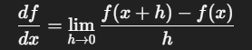
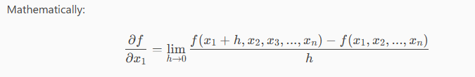
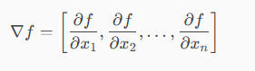

# Vector Calculus

---

## Table Of Content

- [Vector Calculus](#vector-calculus)
  - [Table Of Content](#table-of-content)
  - [What is Vector Calculus?](#what-is-vector-calculus)
  - [The Goal of Calculus](#the-goal-of-calculus)
  - [ML Optimization](#ml-optimization)
  - [Functions in ML](#functions-in-ml)
  - [Intuition to remember](#intuition-to-remember)
  - [Difference Quotient](#difference-quotient)
  - [Derivative](#derivative)
  - [Why Gradients matter in ML](#why-gradients-matter-in-ml)
  - [Sum Rule](#sum-rule)
  - [Chain Rule](#chain-rule)
  - [Product Rule](#product-rule)
  - [Taylor Series](#taylor-series)
  - [Radius Of Convergence](#radius-of-convergence)
  - [Differentiation Rules](#differentiation-rules)
  - [Partial Derivatives](#partial-derivatives)
  - [Gradient](#gradient)
  - [Hessian \& Hessian Matrix](#hessian--hessian-matrix)
  - [Linear Approximation Using Gradient](#linear-approximation-using-gradient)
  - [Summary Table: Vector Calculus for ML](#summary-table-vector-calculus-for-ml)
  - [⚠️ Common Mistakes in Vector Calculus](#️-common-mistakes-in-vector-calculus)

---

## What is Vector Calculus?

Most ML problems reduces to one core task.

*Adjust parameter to minimize error (or maximum likelihood)*.

We always:

- Define a loss/objective function
- Measure how wrong the model is
- Change parameters to reduce that error

Vector calculus gives us the tools to compute how to change parameters efficiently.With it, learning becomes directed optimization.

In ML we deal with:

- Parameters → vectors (weights, biases)
- Data → matrices
- Loss → scalar value

So mathematically:

[
  f : ℝⁿ → ℝ
]

Meaning: A vector of parameters → one number (the loss)

- Input: vector
- Output: scalar

What Vector Calculus Covers

*In ML we mainly use*:

- Partial derivatives
- Gradients
- Jacobians
- Chain rule
- Optimization with constraints

---

## The Goal of Calculus

Calculus is about understanding and controlling change.

Where linear algebra deals with structures and transformations (matrices, vectors, projections), calculus deals with:

- Rates of change → derivatives : “How fast is something changing?”
- Accumulation / total effect → integrals : “What is the total accumulated quantity over time or space?”
- Optimisation → combining derivatives & integrals : “Where is the maximum or minimum?”
- Prediction / modelling : Understand patterns of continuous systems

**In ML terms**:

- Derivative: tells you which way to adjust a weight
- Partial derivative / gradient: tells you which direction in multi-dimensional space to move to reduce error
- Integral: sums or accumulates effects over a dataset or time
- Vector calculus: deals with functions of many variables → your deep network’s weights

---

## ML Optimization

Many ML algorithms are Optimization problems. The goal is to find parameters value that best explains the data. This can be achieved by an objective function.

The objective function could be:

- Loss function
- Likelihood
- Reconstruction error
- Error measure

---

## Functions in ML

A function is a mapping:  **f:R^D^→R**

Where;

x∈ R^D^= input vector (features)
f(x) = output (prediction, loss, probability, etc.)
R^D^= domain (all possible inputs)
f(x) = image / codomain (all possible outputs

---

## Intuition to remember

Intercept = It can be thought as starting point.
Each feature pushes the prediction up or down depending on its weight.
Learning = adjusting weights so predictions match reality as closely as possible.
Error = difference between real value and predicted value.

---

## Difference Quotient

The *difference quotient* measures average rate of change of a function *f* over the trivial [x,x+h].

It’s the numerical approximation of the derivative.

It can be thought as *"How much does 𝑓 change per unit change in 𝑥?"*
$$\frac{df}{dx} = \lim_{h \to 0} \frac{f(x+h) - f(x)}{h}$$

This gives the slope (rate of change) of the function near x.

where;

- h = small change in input
- f(x+h)-f(x) = change in input
- Divide the output change by input change = **rate of change**.

**Why this matters in ML**:

- ML = machines that learn
- “Learning” = tweak inputs (weights) → see effect on output (loss)
- Difference quotient → derivative → tells you which direction to tweak weights
- Without it → you would tweak randomly → model would never improve.

Forward Difference Quotient (most basic)

Central Difference Quotient (more accurate)

Difference Quotient for Arrays (sampled data)
This is the SAME as difference quotient, but NumPy does it for you.

---

## Derivative

Derivative = slope of the tangent line = instantaneous rate of change.

Or simpler: “How fast the output changes when the input changes slightly.”

**Daily Life Applications of Derivatives**:

Derivatives are everywhere — they **measure rates of change**. Examples:

| Scenario | Function | Derivative Use |
|----------|---------|----------------|
| Speed of car | Distance vs time `s(t)` | Derivative = velocity → tells how fast you’re going |
| Economy | Profit vs production | Derivative = marginal profit → tells if producing more increases profit |
| Health | Heart rate over time | Derivative = acceleration of heart rate → stress detection |
| Home / Finance | Investment growth `V(t)` | Derivative = rate of growth → helps with compounding strategies |
| Phones / Apps | Data usage over time | Derivative = rate of usage → alerts, optimisation |

In ML, Derivative = local linear approximation.(Derivative = sensitivity signal.)

- f(x+h)≈f(x)+hf′(x)

If derivative is big → change parameter aggressively
If small → barely change
If zero → stop

Small change in input → predictable linear change in output

That’s why:

- gradients work
- backpropagation works
- Taylor expansion works
- optimization works

---

## Why Gradients matter in ML

Gradients show the direction of steepest ascent.

This is crucial because ML training uses:

- Gradient Descent (move opposite to gradient)

- Backpropagation (uses chain rule + gradients)

- Likelihood maximization (move along gradient)

- Gradient = how fast and in what direction a function increases.

- Optimization = using gradients to find good model parameters.

---

## Sum Rule

The derivative of a sum of two function is the sum of their derivatives.

**Formal Definition**:

if *f(x)* and *g(x)* are differentiable functions, then the derivative is the sum of their derivative.

dxd​[f(x)+g(x)]=dxdf(x)​+dxdg(x)

**Importance in AI/ML**:

- Gradient computation: ML loss functions are almost always sums.the sum lets you compute gradient component-size cleanly and efficiently.
- Optimisation backbone: Gradient descent relies on correct derivatives of summed objective functions; without the sum rule, optimisation breaks.
- Modular modelling: Complex models are built by adding simpler functions (features, penalties). The sum rule preserves linearity, keeping maths tractable.

**Bottom line:**
No sum rule → no clean gradients → no scalable training. This rule is foundational, not optional.

---

## Chain Rule

If a function is composed inside another function, derivative flows through both:

dxd​f(g(x))=f′(g(x))⋅g′(x)

Simple interpretation: differentiate outer × differentiate inner

**Importance in AI/ML**:

- This is the core of deep learning engine
- neural networks are nested functions : y=f3​(f2​(f1​(x)))
  To train the model, we need: dL/dx
  Chain rule gives : dL/dx = dL/df3 . df3/df2 . df2/df1 . df1/dx

This is exactly backpropagation.

---

## Product Rule

If two functions are multiplied:

dxd​[f(x)g(x)]=f′(x)g(x)+f(x)g′(x)

Simply means : first’ × second + first × second’

***In summary :***

- Sum rule → additive losses
- Product rule → weights × inputs
- Chain rule → stacked layers
  
---

## Taylor Series

A Taylor Series is way to approximate a complicated function using an infinite sum of its derivates at a single point.

[Taylor Series Approximation](image-2.png)

**Applications in AI & Machine Learning**:

- Gradient Descent (Core of ML Training)
- Optimization Algorithms (Newton's Method)
- Activation Functions in Neural Networks
- Approximating Probabilities & Softmax

A Taylor series is a local representation: it exactly describes an analytic function only within the disk of convergence centered at the expansion point; beyond that disk, it need not approximate the function at all.

- “Local” = valid near the expansion point.
- Global reconstruction” = trying to describe the whole function domain from one expansion. Taylor alone typically cannot do that.

**Remark**:

- Maclaurin Series = Taylor Series where a = 0
- A Taylor series is a special case of a power series
- First-order Taylor series ignores curvature.
- The **Taylor Polynomial** truncates at degree n, finite number of terms which captures local behavior up to the nth derivative.

---

## Radius Of Convergence

For a Taylor series

f(x)=n=0∑∞​an​(x−a)n,

the radius of convergence R is the largest radius such that the series converges for all x with ∣x−a∣<R and diverges for ∣x−a∣>R.
(At ∣x−a∣=R, it may converge or diverge—case by case.)

---

## Differentiation Rules

Basic differentiation rules (denoting the derivative of f by f′):
Product rule: (f(x)g(x))′ = f′(x)g(x) + f(x)g′(x)
Quotient rule: (f(x) / g(x))′ = (f′(x)g(x) − f(x)g′(x)) / (g(x))²
Sum rule: (f(x) + g(x))′ = f′(x) + g′(x)
Chain rule: (g(f(x)))′ = g′(f(x)) · f′(x)
Here, g ∘ f denotes function composition: x → f(x) → g(f(x)).

---

## Partial Derivatives

It deals with multiple inputs from a certain function.

How the function changes when YOU change ONE variable at a time, keeping all others constant.

Means:

“Only x1​ moves, everything else stays still.”

general product rule, sum rule, and chain rule:

Product rule: ∂/∂x [ f(x) g(x) ] = (∂f/∂x) g(x) + f(x) (∂g/∂x)
Sum rule: ∂/∂x [ f(x) + g(x) ] = ∂f/∂x + ∂g/∂x
Chain rule: ∂/∂x [ g(f(x)) ] = (∂g/∂f) (∂f/∂x)

---

## Gradient

The gradient is a collection of partial derivatives.

When the function returns a single number, the derivative becomes a row vector of partial derivatives or the Jacobian:

The gradient/Jacobian is the same thing.: Definition - The collection of all first-order partial derivatives of a vector-valued function is called the Jacobian.

It is a vector.

Mathematically, the gradient tells: What direction increases the function the fastest.

And the opposite direction: gradient is the direction of steepest descent.

---

## Hessian & Hessian Matrix

It is a way to capture function curves in multiple directions.

for example if you have a function, the **first derivative** tells you the slope in each direction and the second derivative tells you how the slope **changes**(curvature).

**Hessian Matrix**:The hessian matrix collects all the **second derivative**.Important property of it is that it is a *Symmetric Matrix*.

**Hessian in AI/ML:**

In machine learning, we often minimize a loss function L(θ) to train models.

The Hessian tells you:

- how steep or flat the loss landscape is around the parameters.
- which direction are sensitive - if it has large eigenvalues in some direction, small changes in parameters causes big change in loss.

---

## Linear Approximation Using Gradient

The gradient ∇f of a function f(x) is the vector of the first derivatives with respect to all input variables.

It points in the direction of steepest ascent. Its magnitude tells how steep the slope is in that direction.

around a point x0,the function f(x) can be approximated by a plane tangent to the function at x0.

      f(x)≈f(x0​)+∇f(x0​)⋅(x−x0​)

where;

- f(x0) is the value of the function at the point
- (x-x0) is a small displacement from that point
- ∇f(x0) . (x-x0) is how much the function changes linearly along that displacement.

The approximation is **locally accurate**. The further you move away from x0, the worse it becomes.

please note that if the second and higher order derivatives are ignored in the Taylor series, you get **Linear Approximation**.

Linear approximation = tangent plane using the gradient.

---

## Summary Table: Vector Calculus for ML

| Concept | Definition | Key Property | ML Application |
|---------|------------|--------------|----------------|
| **Difference Quotient** | Average rate of change: [f(x+h)-f(x)]/h | Numerical approximation of derivative | Weight updates, numerical gradients |
| **Derivative** | Instantaneous rate of change (slope) | f'(x) = lim_{h→0} [f(x+h)-f(x)]/h | Parameter tuning, sensitivity analysis |
| **Partial Derivative** | Derivative w.r.t one variable, others constant | ∂f/∂xᵢ = change in one direction | Multi-variable optimization, feature importance |
| **Gradient** | Vector of all partial derivatives | ∇f = [∂f/∂x₁, ∂f/∂x₂, ..., ∂f/∂xₙ]ᵀ | Direction of steepest ascent/descent, backpropagation |
| **Jacobian** | Matrix of first-order partial derivatives (vector-output) | Jᵢⱼ = ∂fᵢ/∂xⱼ | Transformations, sensitivity analysis |
| **Hessian** | Matrix of second-order partial derivatives | Hᵢⱼ = ∂²f/∂xᵢ∂xⱼ | Curvature, Newton's method, optimization landscape |
| **Chain Rule** | Derivative of composition: d/dx[f(g(x))] = f'(g(x))·g'(x) | Gradients flow through layers | Backpropagation in neural networks |
| **Sum Rule** | Derivative of sum = sum of derivatives | d/dx[f+g] = f' + g' | Loss functions with multiple terms |
| **Product Rule** | Derivative of product: d/dx[f·g] = f'g + fg' | First×second + first×second' | Weighted combinations, attention mechanisms |
| **Taylor Series** | Function approximation using derivatives | f(x) ≈ f(a) + f'(a)(x-a) + f''(a)(x-a)²/2! + ... | Gradient descent, Newton's method, local approximations |
| **Linear Approximation** | First-order Taylor approximation | f(x) ≈ f(x₀) + ∇f(x₀)·(x-x₀) | Gradient descent update rule |

---

## ⚠️ Common Mistakes in Vector Calculus

1. **Confusing gradient and Jacobian** - Gradient is for scalar outputs, Jacobian for vector outputs
2. **Forgetting to take transpose** - Gradient is a column vector, derivative is a row vector
3. **Ignoring higher-order terms** - Linear approximation is only valid locally
4. **Not checking convexity** - Gradient descent may get stuck in local minima
